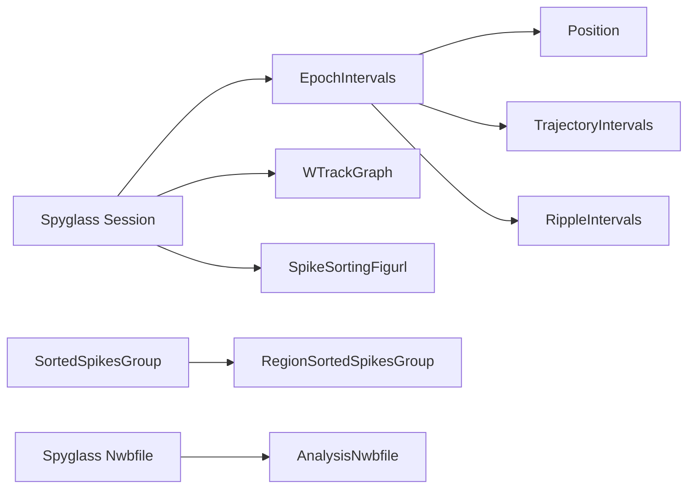
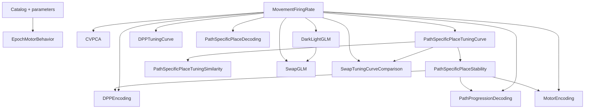
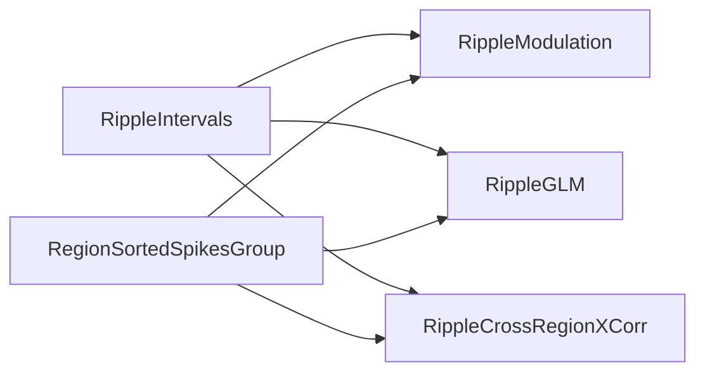

# V1–CA1 Spyglass pipeline

This package defines the project-owned `kyuv1ca1` DataJoint pipeline. It
indexes data already ingested by Spyglass, keeps source NWBs read-only, and
writes computed results to separate analysis NWB files.

Importing `v1ca1.spyglass` is passive. Database connections, schema
activation, ingestion, selection insertion, and population are all explicit.

## Setup

Use the `v1ca1-spyglass` environment. Standard Spyglass ingestion must first
create the session, NWB, and spike-sorting rows.

```python
from v1ca1.spyglass import activate, ingest_v1ca1_nwb

tables = activate()
# Run once per deployment.
tables["analysis_nwbfile"]().register_with_spyglass()

# Inspect the project catalog before inserting it.
preview = ingest_v1ca1_nwb(
    "session_.nwb",
    tables=tables,
    dry_run=True,
)

# Insert pointers and metadata for the already-ingested NWB.
ingest_v1ca1_nwb("session_.nwb", tables=tables)
```

The default schemas are `kyuv1ca1` and `kyuv1ca1_nwbfile`. Pass explicit
schema names to `activate()` when using another deployment.

## Table model

Source and registry dependencies:



The NWB catalog contains:

- `EpochIntervals`
- `TrajectoryIntervals`
- `RippleIntervals`
- `Position`
- `WTrackGraph`
- `SpikeSortingFigurl`

These tables store selectors, object IDs, and small metadata rather than
copying source arrays. `RegionSortedSpikesGroup` provides the shared regional
view of standard Spyglass sorting groups. Persistent unit identity is
`(spikesorting_merge_id, unit_id)`.

Selections use deterministic UUIDv5 keys and freeze parameter and upstream
data hashes. Changing a source, parameter set, or selected-unit cohort requires
a new selection.

## Computed results

There are 17 computed result tables:

| Family | Tables |
| --- | --- |
| Behavior | `EpochMotorBehavior`, `MovementFiringRate` |
| Tuning and population structure | `CVPCA`, `PathSpecificPlaceTuningCurve`, `PathSpecificPlaceTuningSimilarity`, `DPPTuningCurve`, `PathSpecificPlaceStability` |
| Encoding and decoding | `DPPEncoding`, `PathProgressionDecoding`, `PathSpecificPlaceDecoding`, `MotorEncoding` |
| Light/dark comparisons | `DarkLightGLM`, `SwapGLM`, `SwapTuningCurveComparison` |
| Ripple analyses | `RippleModulation`, `RippleGLM`, `RippleCrossRegionXCorr` |

Dependencies between non-ripple computed results are shown below. Catalog and
parameter inputs are omitted except for `EpochMotorBehavior`, which has no
computed parent.



Ripple dependencies:



Exact foreign keys, fields, defaults, and parameter presets are defined in
`table_specs.py`.

Populate computed tables through DataJoint's `populate()` API. Direct
`make()` calls are rejected so analysis-file registration and result
insertion share one transaction. Valid empty inputs produce explicit terminal
result rows rather than disappearing from the pipeline.

## Output

Each computed row owns one immutable analysis NWB file. The row stores its
`AnalysisNwbfile` key, NWB object IDs, semantic hashes, and summary status.
Load results through the table's public loader or `fetch_nwb()`; do not open
the stored path directly.

`PathProgressionDecoding.Transfer` stores selectively fetchable object IDs
for transfers contained in its parent's analysis NWB.

## Key modules

- `table_specs.py`: passive DataJoint definitions and presets.
- `tables.py`: activation and table implementations.
- `nwb.py` and `ingest.py`: NWB cataloging and insertion.
- `spikes.py` and `region_sorted_spikes.py`: regional unit selection and
  spike loading.
- Analysis-specific modules implement computation, NWB conversion, and
  validation.

## Validation

Run Spyglass tests in the dedicated environment:

```bash
conda run -n v1ca1-spyglass pytest -q tests/test_spyglass_*.py
```

The documented Spyglass target is commit
`d5fa7fe1d07c5a349a6d5e0f15d821e5cfe08d38`. Result rows record the actual
V1–CA1 and Spyglass runtime commits.
