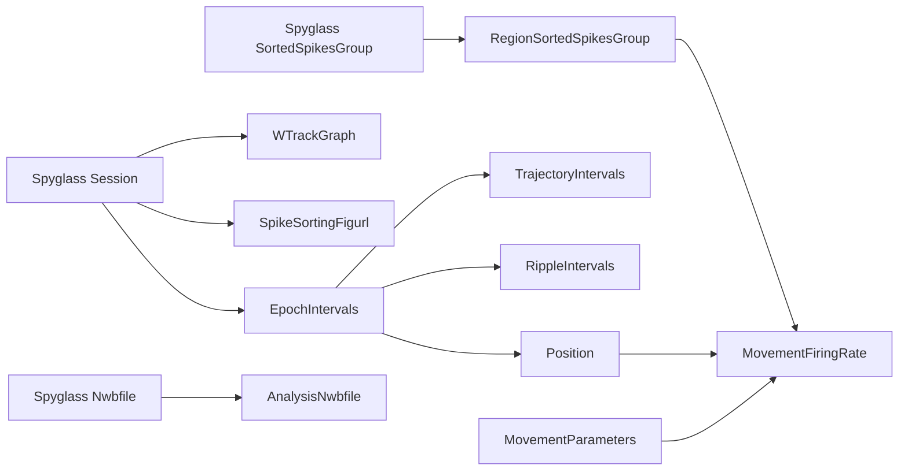
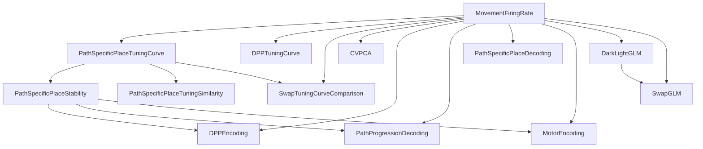
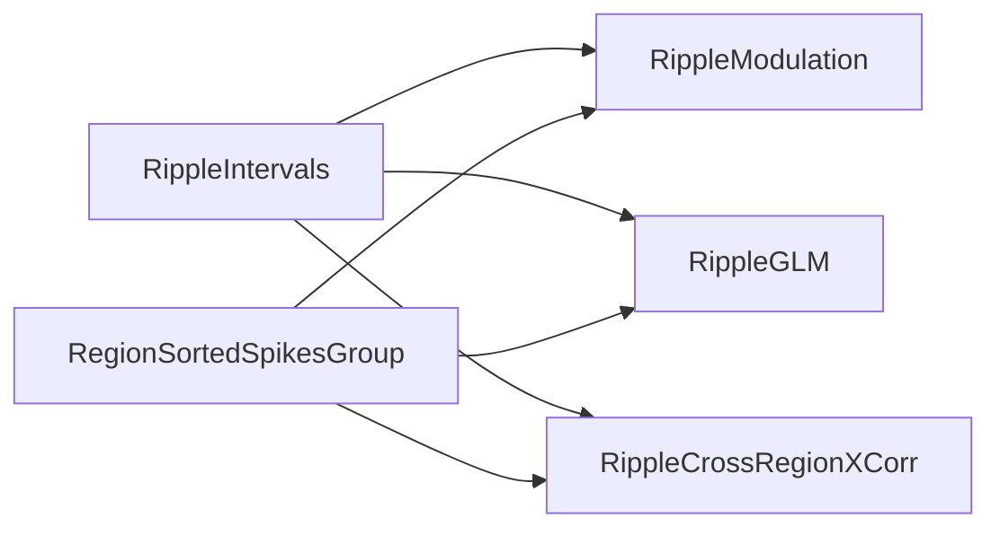

# V1–CA1 Spyglass pipeline

This package defines the project-owned `kyuv1ca1` tables. Importing it is
passive: it does not import DataJoint or Spyglass, connect to a database,
activate a schema, insert rows, or modify an NWB file. `activate()` explicitly
declares the schemas and may perform schema/table DDL when requested, but it
does not ingest data, insert parameters or selections, populate computations,
register artifacts, or write to NWB.

## Organization

- `table_specs.py` contains schema names, DataJoint definitions, and scalar
  defaults without importing DataJoint or Spyglass.
- `nwb.py` catalogs augmented-NWB intervals, named position series, W-track
  inputs, and spike-sorting FigURLs. Its loaders open selected arrays only on
  demand.
- `ingest.py` explicitly inserts NWB object pointers and small metadata into
  the custom source tables after standard Spyglass session ingestion.
- `spikes.py` is the adapter used by `RegionSortedSpikesGroup` to resolve
  standard `SortedSpikesGroup`, `UnitSelectionParams`, and
  `SpikeSortingOutput` parents. It loads canonical ephys-referenced seconds
  and provides Pynapple and SpikeInterface adapters.
- `region_sorted_spikes.py` freezes a region-specific logical view of one
  standard sorting group without materializing units or spike times.
- `selection.py` builds deterministic table-specific UUIDv5 identifiers and
  provenance digests.
- `movement.py`, `epoch_motor_behavior.py`, `ripple_modulation.py`,
  `cv_pca.py`, `path_specific_place.py`, `dpp.py`,
  `tuning_similarity.py`, `stability.py`, `dpp_encoding.py`,
  `path_progression_decoding.py`, `path_specific_decoding.py`,
  `motor_encoding.py`, `dark_light_glm.py`, `swap_glm.py`, and
  `swap_tuning.py` provide database-free computation and atomic artifact
  writing.
- `ripple_cross_region_xcorr.py` provides the fixed ripple-restricted CA1-to-V1
  cross-correlation computation and strict four-artifact legacy registration.
- `offline/` runs selected computation modules directly from an augmented NWB,
  without importing DataJoint or connecting to Spyglass.
- `tables.py` lazily constructs the DataJoint tables and connects source
  readers, selections, computation, and `register_existing()`.
- `__init__.py` exposes the lazy `activate()` and `ingest_v1ca1_nwb()` entry
  points.

## Database-free Figure 1 validation

The first offline slice computes movement firing rate, all/odd/even
path-specific place tuning curves, and odd/even stability. Results are retained
under `/stelmo/kyu/analysis/spyglass/runs/<run-id>`; source NWBs and legacy
artifacts are opened read-only and are never overwritten. Start with L14:

```bash
python -m v1ca1.spyglass.offline.figure_1 \
  --run-id figure1-v1 \
  --animal-name L14 --date 20240611 --epoch 08_r4

python -m v1ca1.paper_figures.figure_1_spyglass \
  --run-id figure1-v1 --mode l14-validation
```

The second command renders a run-local Figure 1D validation without changing
the original Figure 1 script. After adding the other three sessions with the
same run ID and parameters, use `--mode full`; parameter changes require a new
run ID. Offline selection UUIDs are intentionally run-local surrogates; the
artifacts must be re-keyed to actual table selections before database
registration.

## NWB source catalog

The source tables are `EpochIntervals`, `TrajectoryIntervals`, `RippleIntervals`,
`Position`, `WTrackGraph`, and `SpikeSortingFigurl`. They store object paths,
object IDs, row selectors, and small metadata rather than duplicating NWB
arrays. Source loaders reopen the registered NWB read-only.
`TrajectoryIntervals`, `RippleIntervals`, and `Position` depend directly on
`EpochIntervals`, which enforces an audited parent for every epoch-specific
source row. A provenance-selected ripple epoch is inserted even when its NWB
interval table has no events; that row has `ripple_count=0`.
Each `RippleIntervals` row catalogs all ripple start/stop intervals for one
epoch. It indexes the existing NWB `/intervals/ripples` source; the project
table name does not rename or rewrite that NWB object.

`Position` is keyed by `epoch` and the actual `position_series_name`, with a
descriptive `position_role`. The current augmented files catalog both
`head_position` (`head`) and `body_position` (`body`). This avoids baking a
head/body enum into analysis selections and makes the selected NWB series
explicit. `Position.load_position()` applies the NWB-recorded leading-sample
analysis offset by default; it does not rewrite or truncate the source series.

Standard Spyglass ingestion must already have created `Session`, `Nwbfile`,
and the relevant spike-sorting rows. `ingest_v1ca1_nwb()` is the separate,
explicit project ingestion call. Its `dry_run=True` mode reads and validates
the catalog without inserting it.

## Units and immutable selections

`RegionSortedSpikesGroup` is the sole direct spike source for project analyses.
Its shared adapter resolves every standard sorting-group member through
`SpikeSortingOutput`, supports imported and curated merge parents, applies the
associated `UnitSelectionParams` include/exclude labels, checks session and
region provenance, and combines canonical spike times in ephys-referenced
seconds. Persistent unit identity is
`(spikesorting_merge_id, unit_id)`; consecutive Pynapple `TsGroup` keys are
temporary computation keys only. There is no project table with one database
row per unit.

`RegionSortedSpikesGroup` registers an immutable logical view of one standard
sorting group for one region. Its UUIDv5 covers the source group, group
membership, unit-label filters, normalized region, and selected-unit identity
digest. The row stores only those snapshots and the unit count: it creates no
per-unit rows, spike arrays, or artifact files. `register_regions()` is the
explicit insertion operation and skips requested regions with no units;
`load_spikes()` reloads the standard sources and rejects any changed snapshot.
Importing the package or calling `activate()` does not register regional views.

Spike-using selections reference the immutable regional-group UUID rather than
selecting the standard sorting tables again. An explicit `insert_selection()`
also records a SHA-256 digest of every selected parameter value. The natural
source/parameter key plus those immutable references is canonicalized into a
table-specific UUIDv5. Repeating an identical selection therefore produces the
same ID, while changing units or parameter values produces a new one.
Computation revalidates the regional and parameter snapshots before loading
data, so editing an upstream Manual row is rejected rather than silently
changing an existing UUID's meaning.

## Dependency overview

Arrows point from an upstream table to a downstream table. To keep the maps
readable, an analysis family is collapsed from
`sources + XParameters -> XSelection -> X` to its result-table name. The
per-analysis flows below describe the full scientific inputs, parameter rows,
and artifact outputs. `table_specs.py` is authoritative for the exact direct
foreign-key projections.

### Catalog and shared inputs



`WTrackGraph` and `SpikeSortingFigurl` are session-level catalog tables;
`Position`, `TrajectoryIntervals`, and `RippleIntervals` are epoch-level children.
`RegionSortedSpikesGroup` is the only project table that directly selects
standard `SortedSpikesGroup`; every spike-using analysis, including
`MovementFiringRate`, selects the regional view. `AnalysisNwbfile` currently
has no analysis-table children, and `SpikeSortingFigurl` is
provenance/display metadata rather than an analysis input.

### Behavioral, tuning, and model result dependencies

This map shows only dependencies in which one reusable or computed result is
an input to another computed result. Every result also has the catalog,
sorting, and parameter inputs listed in its detailed flow below.



The important multiplicities and exceptions are:

- `PathSpecificPlaceStability` pairs two tuning rows for one path: `odd` and
  `even`. It is the one current computed family without a separate numerical
  parameter table.
- `PathSpecificPlaceTuningSimilarity` consumes four matching `all`-trial
  tuning rows. `SwapTuningCurveComparison` consumes twelve: four paths in
  each of three epochs.
- `DPPEncoding` consumes four path-specific stability rows. It does
  not consume `DPPTuningCurve`; it refits fold-specific model inputs from the
  underlying movement, trajectory, graph, and spike sources.
- `PathProgressionDecoding` consumes two `MovementFiringRate` rows
  and eight stability rows: four each for the target and cohort epochs.
- `MotorEncoding` consumes four path-specific stability rows and retains units
  passing the fixed at-least-one-path stability policy.
- `SwapGLM` is the only result directly downstream of `DarkLightGLM`; it adds
  a held-out light epoch without refitting the upstream models.
- `DPPTuningCurve`, `PathSpecificPlaceTuningSimilarity`, `CVPCA`,
  `DPPEncoding`, `PathProgressionDecoding`,
  `PathSpecificPlaceDecoding`, `MotorEncoding`, `SwapGLM`, and
  `SwapTuningCurveComparison` are currently leaves in the custom table DAG.
  `EpochMotorBehavior` is also a leaf and depends only on catalog and
  parameter rows, so it has no edge in this result-to-result map.

### Ripple result dependencies



`RippleModulation` selects one regional spike group. `RippleGLM` and
`RippleCrossRegionXCorr` each select separate CA1 and V1 regional groups. All
three select the persisted `RippleIntervals` row and are currently leaves.

The diagrams show declared dependencies after collapsing each Parameters,
Selection, and result-table chain. At runtime, NWB-backed loaders also resolve
the registered `Nwbfile`, and the shared spike adapter resolves
`UnitSelectionParams` and each group member through
`SpikeSortingOutput`. Selection builders additionally enforce same-session,
same-epoch, region, unit-order, graph/trajectory, and parameter-snapshot
compatibility. Those loading and validation relationships are deliberately
not drawn as extra foreign-key edges.

## Analysis flows

Ripple modulation uses:

```text
RippleIntervals + EpochIntervals + RippleModulationParameters
    + RegionSortedSpikesGroup
    -> RippleModulationSelection (ripple_modulation_id)
    -> RippleModulation
    -> summary.parquet + peri_ripple_firing_rate.parquet
```

The canonical `RippleIntervals` rows contain the speed-gated events that passed the
detector. The default parameters require the source detector threshold to be
2.0 and require `speed_gated=True`. `RippleModulation` uses every event in that
selected source row; it has no downstream ripple-mean-z-score threshold. A
selected row with `ripple_count=0` remains an explicit `no_ripples` result.

Ripple population encoding uses:

```text
RippleIntervals + EpochIntervals
    + CA1 RegionSortedSpikesGroup + V1 RegionSortedSpikesGroup
    + RippleGLMParameters
    -> RippleGLMSelection (ripple_glm_id)
    -> RippleGLM
    -> manifest.parquet + selected_units.parquet
       + summary.parquet + ripple_glm.nc
```

Each row models one epoch in the fixed CA1-to-V1 direction. CA1 and V1 may
come from different standard sorted-spikes groups, but both regional views
must belong to the selected ripple NWB. The selection freezes the actual
detector threshold and speed-gated flag, every raw ripple start/end pair,
detector and NWB-object provenance, the exact events retained
by single-ripple selection and source/target window clipping, both unit
snapshots, and all parameter/output hashes. The manuscript presets share
0.2-s zero-offset source and target windows, five folds, 100 shuffle refits,
ridge 0.1, seed 45, `maxiter=6000`, and `tol=1e-7`; they differ only between
CA1 `unit_vector` and `mean_activity` predictors. Both require the speed-gated
events detected at z-score threshold 2.0. Units remain inside the audit and
NetCDF artifacts rather than becoming one DataJoint row per unit.

Ripple-restricted cross-region correlation uses:

```text
RippleIntervals + EpochIntervals
    + CA1 RegionSortedSpikesGroup + V1 RegionSortedSpikesGroup
    + RippleCrossRegionXCorrParameters
    -> RippleCrossRegionXCorrSelection (ripple_cross_region_xcorr_id)
    -> RippleCrossRegionXCorr
    -> manifest.parquet + ca1_units.parquet + v1_units.parquet
       + summary.parquet + ripple_cross_region_xcorr.nc
```

Each result covers one epoch and only the exact start/end intervals in its
selected `RippleIntervals` row; it does not pool epochs, substitute generic intervals,
or construct fixed event windows. The fixed manuscript rule uses CA1 as the
reference and V1 as the target, 5-ms bins, lags through 0.5 s, normalized
correlation, and at least 30 ripple spikes per included unit. Both groups must
belong to the same NWB, and events must be speed-gated threshold-2.0
detections. The UUID freezes the raw interval digest, actual detector/NWB
provenance, both unit snapshots, and parameter/output-rule hashes. Unit and
pair results remain in artifacts, including explicit empty/partial statuses.

Epoch motor behavior uses:

```text
EpochIntervals (run) + two aligned Position rows + MovementParameters
    + four TrajectoryIntervals + four natural-direction WTrackGraph rows
    + EpochMotorBehaviorParameters
    -> EpochMotorBehaviorSelection (epoch_motor_behavior_id)
    -> EpochMotorBehavior
    -> manifest.parquet + distribution_summary.parquet
       + progression_summary.parquet + trajectory_qc.parquet
```

Each row covers one run epoch. The selected primary position supplies
translation and track linearization; the separately named, aligned reference
series supplies orientation. Neither role is hard-coded to a current
`head_position` or `body_position` name. Both series must use centimeters,
share exact already-offset timestamps and sampling metadata, and retain the
catalogued leading-sample offset without a second truncation. The selection
UUID freezes the epoch catalog row, both position rows and their exact loaded
samples, every trajectory catalog row and interval bound, every graph catalog
row and exact linearization input, the fixed 4 cm/s and 0.1 s movement row,
the progression-bin parameter, and the output rule. The only analysis-owned
parameter is progression bin size (4 cm in the manuscript preset).

Movement firing rate uses:

```text
Position + MovementParameters
    + RegionSortedSpikesGroup
    -> MovementFiringRateSelection (movement_firing_rate_id)
    -> MovementFiringRate
    -> movement_firing_rate.parquet + movement_intervals.npz
```

`MovementFiringRateSelection` identifies one named, epoch-specific position
series, immutable regional spike group, and movement parameter set. The
default parameters define movement as speed above 4.0 cm/s after smoothing
speed with a 0.1 s sigma. `MovementFiringRate.make()` applies the position
series' NWB-recorded analysis offset, derives movement once, and saves both the
exact Pynapple `IntervalSet` in ephys-referenced seconds and the corresponding
epoch-wide firing rates. Movement rows are not restricted to run epochs; a
sleep epoch is valid whenever its selected Position series exists.

The Parquet contains one row for every unit selected by the sorting-group,
label, and region filters, keyed persistently by
`(spikesorting_merge_id, unit_id)`. It does not apply a firing-rate prefilter.
When movement support is valid, a unit with no movement spikes is retained with
`movement_spike_count=0` and `movement_firing_rate_hz=0.0`. The result status is
one of:

- `valid`: positive-duration movement support exists, so every selected unit
  has a finite movement firing rate.
- `no_units`: no units survive the upstream sorting-group filters; the Parquet
  and IntervalSet are canonical empty artifacts.
- `no_valid_position`: fewer than two usable position or speed samples remain;
  selected units are retained with undefined rates and the IntervalSet is
  empty.
- `no_movement`: position and speed are usable but no positive-duration
  movement support exceeds the threshold; selected units are retained with
  undefined rates and the IntervalSet is empty.

Light/dark cross-validated PCA uses:

```text
light/dark EpochIntervals + RegionSortedSpikesGroup
    + matching light/dark MovementFiringRate rows and Position series
    + eight epoch-specific TrajectoryIntervals
    + center_to_left/center_to_right WTrackGraph rows + CVPCAParameters
    -> CVPCASelection (cv_pca_id)
    -> CVPCA
    -> manifest.parquet + cv_pca.nc + summary.parquet
       + within_spectrum.parquet + selected_units.parquet
       + lap_assignments.parquet + trajectory_qc.parquet
```

Each result is one session, explicitly labeled light run, dark run, regional
sorting group, and named random-seed parameter row. The region comes only from
`RegionSortedSpikesGroup`; it is not duplicated in the parameter table. Both
movement rows must have the same sorting snapshot, exact unit order, movement
definition, and NWB file as the regional group. The selection UUID freezes
both epoch records, untrimmed position samples and timestamps, movement-rate
files and exact movement support, all eight lap sources, both graph inputs,
the complete parameter row, and the fixed output rule.

The standalone computation receives each untrimmed position series and
applies the NWB-recorded 10-sample analysis offset exactly once. It
concatenates the four path-specific physical-place representations in the
fixed trajectory order, treats inbound paths in the from-center direction,
randomly partitions all laps into disjoint groups with the named seed, and
retains only position bins shared across every light and dark group. V1 and
CA1 manuscript presets use the same seed-47 analysis and differ only in their
explicit minimum movement firing-rate thresholds (0.5 and 0.0 Hz). Expected
empty-input outcomes such as no movement, insufficient laps, or no eligible
units are written as complete terminal artifacts rather than leaving the
selection unpopulated.

Path-specific place tuning and stability use:

```text
TrajectoryIntervals + WTrackGraph + MovementFiringRate
    + TuningCurveParameters + trial_subset
    -> PathSpecificPlaceTuningCurveSelection
    -> PathSpecificPlaceTuningCurve

odd PathSpecificPlaceTuningCurve + even PathSpecificPlaceTuningCurve
    -> PathSpecificPlaceStabilitySelection
    -> PathSpecificPlaceStability
    -> stability.parquet

four matching all-trial PathSpecificPlaceTuningCurve rows
    + TuningSimilarityParameters
    -> PathSpecificPlaceTuningSimilaritySelection
    -> PathSpecificPlaceTuningSimilarity
    -> similarity.parquet
```

Each tuning row covers one epoch, trajectory, graph configuration, named
position series, region, sorting group, parameter set, and `all`, `odd`, or
`even` trials. The graph configuration must match the trajectory. Its `make()`
loads the saved movement IntervalSet and all-unit firing-rate Parquet through
the selected `MovementFiringRate` row; it does not recompute speed or movement
support. The NetCDF DataArray retains every selected unit and records stable
unit identity, physical path position in centimeters, normalized path
fraction, subset spike counts, trial/support metadata, and fixed QC status.

`TuningCurveParameters` provides an explicit legacy-compatible 4 cm,
unsmoothed preset and the Figure 1D 50-bin, 1.5-bin Gaussian-smoothed preset.
`PathSpecificPlaceStability` has no separate numerical parameter table: each
row consumes a matching persisted odd/even tuning-curve pair and applies fixed
QC rules. The stability Parquet retains every selected unit, including
undefined correlations, with explicit QC/status columns; firing-rate and
stability thresholds remain downstream selection choices. `no_units`,
`no_valid_position`, and `no_movement` propagate from the movement result;
otherwise stability reports `valid` when at least one unit has a valid
correlation and `no_valid_units` when none does.

Each tuning-similarity result is one session, epoch, region, tuning
configuration, similarity metric, and matching set of four all-trial curves.
The supported metrics are `correlation`, `absolute_overlap`, and
`shape_overlap`. Its Parquet has one row per unit and path-pair comparison—four
rows per unit for the two turn and two arm comparisons. It retains undefined
scores with QC and copies `movement_firing_rate_hz` from the shared upstream
movement result without filtering units. DPPI, significance testing, and
cross-epoch aggregation remain downstream analysis or figure logic.

Directional path progression (DPP) tuning uses:

```text
outbound TrajectoryIntervals + inbound TrajectoryIntervals
    + their two WTrackGraph rows + MovementFiringRate
    + TuningCurveParameters + turn_type + trial_subset
    -> DPPTuningCurveSelection
    -> DPPTuningCurve
```

Each DPP row is one epoch, left- or right-turn pair, and `all`, `odd`, or
`even` trial subset. The fixed left pair is `center_to_left` plus
`right_to_center`; the fixed right pair is `center_to_right` plus
`left_to_center`. Odd/even trials are selected independently within each
constituent trajectory. Their normalized, direction-aligned position samples
and movement support are then pooled before a single tuning curve is
estimated—constituent tuning curves are never averaged. Both source interval
and graph rows are explicit foreign keys, so the database enforces a common
NWB session and epoch and the artifact records separate constituent trial and
support summaries. The two graph paths must have one common physical length;
this preserves the legacy interpretation of a shared centimeter bin size on
the pooled normalized coordinate.

DPP encoding uses:

```text
RegionSortedSpikesGroup + MovementFiringRate
    + four TrajectoryIntervals + four trajectory WTrackGraph rows
    + full_w WTrackGraph
    + four PathSpecificPlaceStability rows backed by
      legacy_4cm_unsmoothed odd/even curves
    + DPPEncodingParameters
    -> DPPEncodingSelection
    -> DPPEncoding
    -> dpp_encoding.parquet
```

The manuscript preset fixes five lap-wise folds, 50-ms evaluation bins, 4-cm
spatial bins, one-bin Gaussian smoothing, and random seed 47. It selects units
with epoch-wide movement firing rate at least 0.5 Hz and stability correlation
at least 0.5 on at least one of the four trajectories. These criteria are
explicit parameters of this eligible-unit comparison; the upstream movement
and stability artifacts remain complete all-unit results. The standalone
`task_progression.encoding_comparison` command retains its general 20-ms
default, so the 50-ms choice is selected explicitly by this preset.
Each trajectory receives a deterministic independent lap shuffle, and neither
spatial bins nor Gaussian smoothing cross concatenated path or DPP boundaries.

Training-fold tuning curves are refit for four fixed Poisson encoding models:
path-specific physical place, direction-independent absolute place on the
full W-track, same-turn DPP, and start-to-goal distance-to-reward. One Parquet
row per eligible unit records persistent identity, eligibility inputs, total
held-out log likelihoods in nats, information relative to the null model in
bits per spike, DPP-minus-alternative contrasts, and model/unit QC. It does
not create one DataJoint row per unit.

The computed table names are `RippleModulation`, `MovementFiringRate`,
`PathSpecificPlaceTuningCurve`, `PathSpecificPlaceTuningSimilarity`,
`DPPTuningCurve`, `PathSpecificPlaceStability`,
`DPPEncoding`, `CVPCA`, `PathProgressionDecoding`,
`PathSpecificPlaceDecoding`, `MotorEncoding`, `DarkLightGLM`,
`SwapGLM`, `SwapTuningCurveComparison`, `RippleGLM`,
and `RippleCrossRegionXCorr`—there is no `Computed` suffix.
Empty but valid selections are recorded through explicit terminal statuses
rather than being silently omitted.
Its explicit selection and parameter rows do not populate it automatically.

Cross-path path-progression decoding uses:

```text
RegionSortedSpikesGroup
    + target MovementFiringRate + four target stability rows
    + cohort MovementFiringRate + four cohort stability rows
    + target four TrajectoryIntervals + four WTrackGraph rows
    + PathProgressionDecodingParameters
    -> PathProgressionDecodingSelection
    -> PathProgressionDecoding
    -> manifest.parquet + unit_eligibility.parquet
       + decoding_summary.parquet + Pynapple true/decoded NPZ files
```

Each result remains one target epoch and region. The selection also names one
cohort epoch. Selecting the target epoch as its own cohort performs ordinary
single-epoch filtering. Reciprocal light-to-dark and dark-to-light selections
derive the same symmetric intersection of eligible persistent units, so the
two population decoders cannot silently use different neural populations.
The per-unit eligibility audit is a Parquet artifact, not one DataJoint row
per unit.

The manuscript-compatible scalar preset uses 20-ms decode bins, a four-bin
sliding window, 4-cm path bins, movement firing rate at least 0.5 Hz in both
epochs, and no stability threshold. If a stability threshold is supplied, a
unit must meet it on at least one trajectory in each epoch. This symmetric
cohort is an intentional new policy: the legacy manuscript workflow selected
units from the dark epoch alone and reused them in both epochs. The policy and
fixed 16-pair transfer specification are hashed into every selection UUID.
The eight selected stability rows remain explicit upstream dependencies even
when the threshold is disabled; their correlations are retained in the unit
eligibility audit but do not affect eligibility. Fixed coordinate and binned-
error summary semantics are frozen by a separate output-rule hash.

The 16 directed transfers comprise same-turn/cross-arm,
opposite-turn/same-arm, flipped opposite-turn/same-arm, and
same-inbound-or-outbound/cross-arm comparisons. All use normalized
start-to-goal path progression and one shared eligible population. The legacy
within-epoch path-specific-place decoder remains a separate result because it
uses all units in the selected regional group.
Cross-epoch and reload joins use persistent sorting-output/unit identities;
ephemeral Pynapple `TsGroup` keys are stored only as local artifact metadata.
All NPZ timestamps are seconds on the augmented NWB's ephys timestamp
reference; true-position and decoded grids may differ and are aligned by
interpolation when errors are summarized.

Within-epoch path-specific place decoding uses:

```text
RegionSortedSpikesGroup + MovementFiringRate
    + four TrajectoryIntervals + four WTrackGraph rows
    + PathSpecificPlaceDecodingParameters
    -> PathSpecificPlaceDecodingSelection
    -> PathSpecificPlaceDecoding
    -> manifest.parquet + selected_units.parquet + fold_qc.parquet
       + decoding_summary.parquet + decoding_error_by_position.parquet
       + Pynapple true/decoded NPZ files
```

One result covers one run epoch and region. It preserves the manuscript's
all-unit policy and concatenates the four trajectories into non-overlapping
physical-position ranges in the fixed legacy order. Each cross-validation
fold refits its tuning curve from training laps only. Fold failures remain in
the QC table and yield `partial_valid` or `no_valid_decodes` rather than
silently removing units. Legacy true/decoded NPZ pairs can be registered only
against an explicit current selection; their parameter assumptions and
reconstructed fold coverage are retained as provenance.

Motor encoding uses:

```text
RegionSortedSpikesGroup + MovementFiringRate
    + primary Position + orientation-reference Position
    + four TrajectoryIntervals + four trajectory WTrackGraph rows
    + full_w WTrackGraph + four PathSpecificPlaceStability rows
    + MotorEncodingParameters
    -> MotorEncodingSelection
    -> MotorEncoding
    -> manifest.parquet + selected_units.parquet
       + nested_cv.nc + full_refit.nc
```

One result covers one run epoch and region. The two position series may have
arbitrary names and roles, but they must be distinct centimeter series on the
same timestamp grid. The primary series supplies speed, acceleration, and
track linearization; subtracting the orientation-reference series from it
supplies head direction and its derivatives. The primary series must also be
the one used by the selected `MovementFiringRate` row. All path lengths and
the generalized full-W coordinate come from the five selected NWB graph rows
rather than an animal-name geometry lookup.

The fixed family is the existing nine-model motor/DPP/place comparison. Each
model selects ridge and, where applicable, spatial resolution by inner
lap-wise CV inside each outer lap-wise fold. Both manuscript presets require a
stability correlation of at least 0.5 on at least one of the four paths; the V1
and CA1 presets differ only in their strict movement-firing-rate thresholds
(`> 0.5` and `> 0.0` Hz). The selected stability rows are all-unit upstream
artifacts, so the threshold changes eligibility without changing their saved
contents. `nested_cv.nc` is held-out evidence. `full_refit.nc` refits the
selected hyperparameters to all eligible samples for coefficient and rate-curve
visualization; it is not held-out evidence. The Parquet unit audit maps
temporary group keys to persistent sorting-output/unit identities and records
movement-rate and at-least-one-path stability eligibility without creating one
DataJoint row per unit. If a population fit fails or returns non-finite
parameters for only some units, those units are retried independently;
unresolved units remain explicit invalid entries in the audit and do not
discard finite evidence from other units.

The dark/light GLM comparison uses:

```text
RegionSortedSpikesGroup
    + dark MovementFiringRate + light MovementFiringRate
    + four dark TrajectoryIntervals + four light TrajectoryIntervals
    + four shared trajectory WTrackGraph rows + DarkLightGLMParameters
    -> DarkLightGLMSelection
    -> DarkLightGLM
    -> manifest.parquet + selected_units.parquet + selection_summary.nc
       + candidates/*.nc + selected/{model}.nc
```

One result couples one dark run, one explicitly labeled light run, and one
region. Both movement rows must use the same NWB, sorting snapshot, region,
unit set, and movement-parameter snapshot. Their selected position series are
loaded indirectly to derive graph-based path progression and, when enabled,
the speed covariate. The selection freezes all eight epoch-specific lap tables
and the four shared centimeter W-track graphs.

The four fixed models are independent dark/light fields (`visual`), a shared
dark scaffold with segment-bump gain, the corresponding segment-scalar gain,
and dense gain. The current v5 presets select physical spatial-bin candidates;
explicit v4 presets exist only for honest registration of manuscript-era
spline-count artifacts. The visual model selects the shared evaluation-bin and
place-basis candidate, after which each comparison model selects its ridge.
V1 and CA1 presets use strict movement-rate thresholds in both epochs of
`> 0.5` Hz and `> 0.0` Hz, respectively. Failed population units are retried
independently; the all-unit Parquet records whether each eligible unit has all
16 selected model-by-trajectory fits, producing `partial_valid` when needed.
If no unit has a complete selected fit, the same audit is retained with
`no_valid_units` rather than leaving the selection perpetually unpopulated.

Held-out swapped-light scoring uses:

```text
DarkLightGLM + RegionSortedSpikesGroup
    + held-out light MovementFiringRate
    + four held-out light TrajectoryIntervals
    + four shared trajectory WTrackGraph rows + SwapGLMParameters
    -> SwapGLMSelection
    -> SwapGLM
    -> manifest.parquet + selected_units.parquet + swap_glm.nc
```

One result scores an exact selected dark/light fit on a distinct held-out light
run from the same NWB and regional sorting group. It reuses the four selected
DarkLightGLM model files without refitting, freezes their checksums and the
upstream parameter/output-rule digests, and requires the same movement
definition across all three epochs. The held-out light condition must differ
from the training light condition.

The selected held-out `MovementFiringRate` terminal status is authoritative:
`no_valid_position` and `no_movement` propagate directly and must agree with
an empty saved movement interval.

All upstream-selected units remain in saved order. A unit is a valid swap
score only when its upstream selected GLM fit is valid and every expected
model-by-trajectory primary score is finite. If any held-out trajectory has no
movement-supported samples, the whole result is retained as the explicit
`no_trajectory_samples` terminal state rather than fabricating a partial-path
comparison. Legacy registration normalizes the complete schema-4 or schema-6
artifact, verifies its selected DarkLightGLM sources and historical position
offset and movement-speed threshold, then exactly re-scores the selected NWB
inputs without refitting. A four-source-model schema-4 artifact is compared on
all values it contains; the canonical `dark` score is then evaluated from the
verified task-segment-bump source rather than copied from a missing value.

The empirical swapped-light tuning comparison uses:

```text
RegionSortedSpikesGroup
    + dark/train-light/test-light MovementFiringRate rows
    + twelve all-trial, unsmoothed 4-cm PathSpecificPlaceTuningCurve rows
    + three EpochIntervals + SwapTuningCurveComparisonParameters
    -> SwapTuningCurveComparisonSelection
    -> SwapTuningCurveComparison
    -> manifest.parquet + selected_units.parquet
       + summary.parquet + swap_tuning.nc
```

One result row covers one dark-training epoch, one light-training epoch, one
distinct light-test epoch, one region, and one parameter preset. It does not
create DataJoint rows per unit, trajectory, or model. The twelve source curves
are the four paths in each epoch; their unsmoothed, all-trial 4-cm values are
frozen by checksum. The analysis applies the legacy NaN interpolation and
Gaussian smoothing itself, builds the six fixed visual, dark, pointwise and
segment multiplicative-ratio, and pointwise and segment additive-delta models,
and scores only the configured swapped segment of each held-out trajectory.
Outbound paths use the opposite arm's final segment; inbound paths use the
opposite arm's first segment. Training curves use the full movement-supported
trajectory.

The V1 and CA1 manuscript presets both use 50-ms evaluation bins and one-bin
Gaussian smoothing. V1 requires epoch-wide movement firing rates strictly
greater than 0.5 Hz in both training epochs; CA1 requires rates strictly
greater than 0 Hz. The held-out epoch is not a firing-rate filter. Every source
unit remains in `selected_units.parquet`, while the NetCDF and long-form
summary contain the eligible population; the summary has one row per eligible
persistent unit, trajectory, and empirical model. The parameter columns are
`evaluation_bin_size_s`, `gaussian_smoothing_sigma_bins`,
`min_dark_firing_rate_hz`, and `min_light_firing_rate_hz`. The standalone
`task_progression.swap_tuning_curve_comparison` default remains 20 ms; the
manuscript presets deliberately select 50 ms. Result statuses are `valid`,
`partial_valid`, `no_units`, `no_eligible_units`, `upstream_terminal`,
`no_valid_position`, `no_movement`, `no_trajectory_samples`, and
`no_valid_units`.

## Artifacts and provenance

New results are written under the configured `filepath@analysis` store,
defaulting to `/stelmo/nwb/analysis/kyu/v1ca1`, with session-first paths:

```text
<root>/<animal>/<date>/ripple_modulation/<epoch>/<region>/<uuid>/
    summary.parquet
    peri_ripple_firing_rate.parquet

<root>/<animal>/<date>/movement_firing_rate/<epoch>/<region>/<uuid>/
    movement_firing_rate.parquet
    movement_intervals.npz

<root>/<animal>/<date>/epoch_motor_behavior/<epoch>/<uuid>/
    manifest.parquet
    distribution_summary.parquet
    progression_summary.parquet
    trajectory_qc.parquet

<root>/<animal>/<date>/cv_pca/<light>_vs_<dark>/<region>/<uuid>/
    manifest.parquet
    cv_pca.nc
    summary.parquet
    within_spectrum.parquet
    selected_units.parquet
    lap_assignments.parquet
    trajectory_qc.parquet

<root>/<animal>/<date>/path_specific_place_tuning_curve/<epoch>/<trajectory>/<subset>/<region>/<uuid>/
    tuning_curve.nc

<root>/<animal>/<date>/dpp_tuning_curve/<epoch>/<turn>/<subset>/<region>/<uuid>/
    tuning_curve.nc

<root>/<animal>/<date>/path_specific_place_tuning_similarity/<epoch>/<region>/<metric>/<uuid>/
    similarity.parquet

<root>/<animal>/<date>/path_specific_place_stability/<epoch>/<trajectory>/<region>/<uuid>/
    stability.parquet

<root>/<animal>/<date>/dpp_encoding/<epoch>/<region>/<uuid>/
    dpp_encoding.parquet

<root>/<animal>/<date>/path_progression_decoding/<epoch>/<region>/<uuid>/
    manifest.parquet
    unit_eligibility.parquet
    decoding_summary.parquet
    cross_path_error_by_position.parquet
    cross_<family>_<source>_to_<target>_{true,decoded}.npz

<root>/<animal>/<date>/path_specific_place_decoding/<epoch>/<region>/<uuid>/
    manifest.parquet
    selected_units.parquet
    fold_qc.parquet
    decoding_summary.parquet
    decoding_error_by_position.parquet
    {true,decoded}_place.npz

<root>/<animal>/<date>/motor_encoding/<epoch>/<region>/<uuid>/
    manifest.parquet
    selected_units.parquet
    nested_cv.nc
    full_refit.nc

<root>/<animal>/<date>/dark_light_glm/<light>_vs_<dark>/<region>/<uuid>/
    manifest.parquet
    selected_units.parquet
    selection_summary.nc
    candidates/*.nc
    selected/{visual,task_segment_bump,task_segment_scalar,task_dense_gain}.nc

<root>/<animal>/<date>/swap_glm/<light-train>_train_to_<light-test>_test/dark_<dark>/<region>/<uuid>/
    manifest.parquet
    selected_units.parquet
    swap_glm.nc

<root>/<animal>/<date>/swap_tuning_curve_comparison/<light-train>_train_to_<light-test>_test/dark_<dark>/<region>/<uuid>/
    manifest.parquet
    selected_units.parquet
    summary.parquet
    swap_tuning.nc

<root>/<animal>/<date>/ripple_glm/<epoch>/<uuid>/
    manifest.parquet
    selected_units.parquet
    summary.parquet
    ripple_glm.nc

<root>/<animal>/<date>/ripple_cross_region_xcorr/<epoch>/<uuid>/
    manifest.parquet
    ca1_units.parquet
    v1_units.parquet
    summary.parquet
    ripple_cross_region_xcorr.nc

```

If `activate(artifact_root=...)` is used, that root must remain inside the
stage configured for DataJoint's `analysis` store; otherwise DataJoint cannot
insert the resulting `filepath@analysis` value. Fixed-width centimeter bins
retain the legacy padded final edge. Consequently, `path_fraction` is exactly
the centimeter bin center divided by graph length and its last value may be
slightly greater than 1.

`make()` computes from the selected sources, writes a new artifact bundle, and
inserts the result row. It never writes results into the source NWB.
`MovementFiringRate` is compute-only: its Parquet and Pynapple-backed NPZ are
written and validated together. `RippleModulation`,
`PathSpecificPlaceTuningCurve`, `PathSpecificPlaceTuningSimilarity`,
`DPPTuningCurve`, `PathSpecificPlaceStability`, `DPPEncoding`,
`CVPCA`, `PathSpecificPlaceDecoding`, `MotorEncoding`,
`DarkLightGLM`, `SwapGLM`, `SwapTuningCurveComparison`, `RippleGLM`,
`RippleCrossRegionXCorr`, and `EpochMotorBehavior` additionally provide
`register_existing()`, which
validates matching legacy artifacts, copies selected content into the
canonical path, and inserts a result row without invoking the computed table's
`make()` route. Strict scientific validation may reconstruct the selected NWB
result, as described below.
Ripple-GLM registration requires both regional views to resolve uniquely to
`ImportedSpikeSorting` IDs. It verifies NWB-backed event/window coordinates,
resolved unit axes, target count matrices, fold layout, metric arithmetic, and
coefficient axes, shape, and finiteness before accepting and normalizing the
legacy NetCDF. It does not refit the model or compare coefficient values
against an independent refit.
Cross-region-xcorr registration requires separate CA1 and V1
`ImportedSpikeSorting` identity resolvers and the exact legacy CA1 unit audit,
V1 unit audit, pair summary, and NetCDF. It recomputes the selected NWB result
and compares all four scientific artifacts before writing the canonical
bundle; terminal results are computed directly rather than legacy-registered.
Epoch-motor registration accepts the legacy session-wide distribution and
progression Parquets, selects exactly one epoch, recomputes that epoch from
the frozen NWB position/interval/graph sources, and compares all scientific
rows before writing the canonical bundle. An optional original run log is
validated and retained as provenance. The trajectory-QC table is always
generated from the current frozen NWB recomputation rather than trusted from
legacy files.
cvPCA registration requires the complete legacy seed-specific NetCDF and
summary pair. It recomputes the exact selected NWB inputs, compares all
retained scientific coordinates and variables, and then writes a compact
canonical bundle. The legacy full residual matrix and the scientifically
invalid residual-fraction-by-unit-class array are deliberately excluded; the
selected-unit audit, lap assignments, and QC come from the frozen
recomputation. Terminal selections are computed directly rather than
legacy-registered.
Tuning-curve registration accepts only the legacy-compatible all-trial preset;
odd/even rows are recomputed from NWB. It also requires the legacy cleaned-DLC
`head_position` source, its 10-sample analysis offset, and the 4.0 cm/s,
0.1 s-sigma movement defaults; a different position or movement definition
must be recomputed.
Similarity registration accepts only a complete `*_all_units.parquet` source
for the legacy 4 cm unsmoothed, all-trial tuning configuration and matching
imported sorting selection; it validates all four comparisons for every
selected unit before copying the canonical result.
`DPPEncoding.register_existing()` accepts one
matching legacy epoch summary, resolves it against the selected regional
group, movement rates, and four stability rows, validates the exact eligible
unit set, converts legacy per-spike likelihoods to canonical total nats, and
copies it to the UUID-keyed path. It does not register the legacy light/dark
join or cross-trajectory-transfer outputs.
The legacy filename verifies the fold count and temporal/spatial bins.
Smoothing, random seed, and fold-level QC are not encoded, so those limitations
are retained explicitly as caller-attested, unreconstructed provenance.
Motor registration accepts an exact nested-CV/full-refit NetCDF pair,
validates their shared session, region, epoch, model, parameter, and unit
coverage, resolves temporary unit coordinates against the selected regional
sorting group, and copies both into one immutable canonical bundle.
Dark/light registration requires the exact visual candidate grid, the three
comparison candidates at the selected visual basis, all four selected-model
NetCDFs, and their selection summary. It validates v4/v5 basis semantics,
current graph geometry, movement-rate vectors, and every imported unit before
copying the coupled bundle.
Swap registration requires the exact selected DarkLightGLM bundle frozen by
the selection, verifies the held-out session/epoch/parameter contract and
historical preprocessing choices, then performs an exact NWB re-score without
refitting. Every available legacy scientific coordinate and variable must
match before the recomputed canonical NetCDF is written with persistent
group-unit identities.
Swap-tuning registration is limited to the available V1 legacy artifacts and
matching imported sorting. It requires the historical 10-sample position
offset and 4.0 cm/s movement threshold, reconstructs and re-scores the selected
NWB inputs, and compares every scientific coordinate and variable before
writing the canonical bundle. The legacy file's temporary integer unit
coordinate and summary alone are not treated as proof of equivalence.
Legacy registration is restricted to matching `ImportedSpikeSorting`
selections. Registration requires complete canonical schemas; ripple
peri-event data must also contain one complete, common time grid for every
unit. Canonical empty artifacts are accepted and recorded with the applicable
terminal status.

`PathProgressionDecoding` is compute-only. Legacy decoding NPZ
files contain decoded values and times but no selected-unit identities,
sorting snapshot, parameters, graph identifiers, or output checksums. The
untagged manuscript runs also lack companion selected-unit audit tables, so a
normal `register_existing()` could not prove equivalence and is deliberately
not exposed.

UUID-keyed destinations and result rows are immutable. `register_existing()`
rejects `overwrite=True` and checks for an existing row before calling the
artifact hook. With `skip_duplicates=True`, it returns that row without
touching files; otherwise a duplicate is an error. A new result is inserted
directly into the computed table only after this preflight and artifact
validation. For tables that support both routes, both record `artifact_origin`,
a selected-unit digest, and the actual runtime commits. Registration
additionally retains source paths, source hashes, and any supplied source
commits. `MovementFiringRate` records the selected-unit digest and runtime
commits directly on its compute-only result.

The project `AnalysisNwbfile` table remains available for future outputs that
fit an NWB-native container. The current file-backed analyses use
`filepath@analysis`; activation does not register `AnalysisNwbfile` globally.
Call `register_with_spyglass()` explicitly if it is needed later.

## Environment and version provenance

Run these tables from the separate `v1ca1-spyglass` environment. This keeps
the current V1–CA1 SpikeInterface environment used by sorting and curation
separate from Spyglass's dependency set. Install this repository there without
the full `v1ca1[analysis]` extra, then add the pipeline runtime dependencies,
including the local Spyglass checkout, PyNWB 3.1.3 or newer, Pynapple,
PyArrow, position-tools, and track-linearization.

The documented local Spyglass target is commit
`d5fa7fe1d07c5a349a6d5e0f15d821e5cfe08d38`. Result rows record the actual
runtime V1–CA1 and Spyglass commits. A different commit is retained as
provenance rather than rejected at runtime.

See the repository [Spyglass setup and usage](../../../README.md#project-spyglass-pipeline)
for the activation and ingestion sequence.
